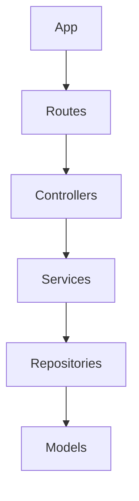
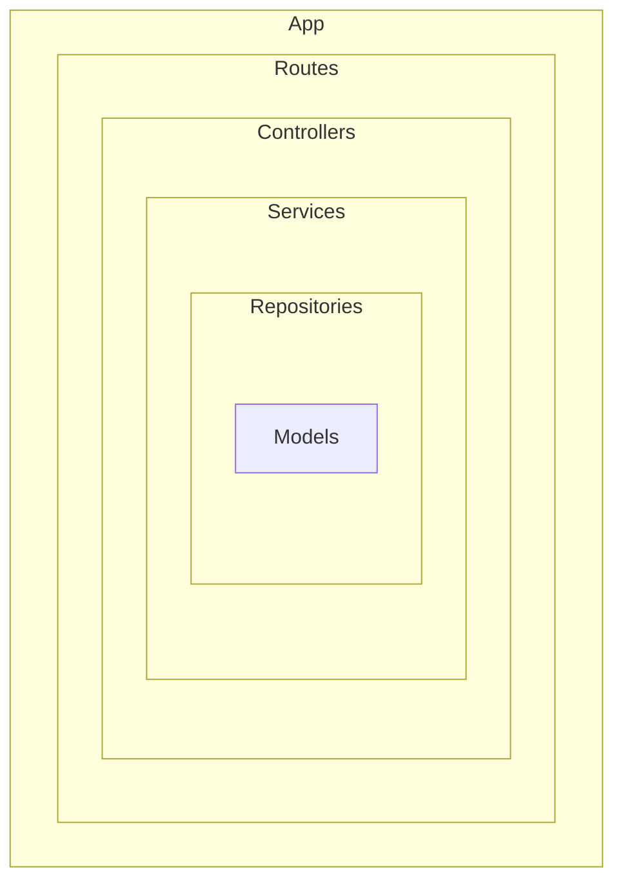

# Ata da Aula da Turma FS36 - 13 de fevereiro de 2025

## Inicialização de um projeto backend
- Comandos iniciais
- Instalação de bibliotecas básicas:
  - dotenv
  - express
  - nodemon
  - pg
  - sequelize

## Noções de Arquitetura em Camadas
- Essa estrutura é bastante usada em aplicações Node.js com frameworks como Express e NestJS, pois promove a separação de responsabilidades e facilita manutenção e testes.

## Camadas de uma aplicação
- **App**: Ponto de entrada da aplicação
- **Routes (Rotas)**: Define os endpoints e direciona as requisições.
- **Controllers (Controladores)**: Processa as requisições, chamando os serviços necessários, é um intermediário entre as camadas de rotas e serviços.
- **Services (Serviços)**: Contém a lógica de negócio da aplicação.
- **Repositories (Repositórios)**: Responsável por acessar o banco de dados, geralmente interagindo com os Models.
- **Models (Modelos)**: Representam as entidades e suas estruturas no banco de dados.

## Representações das Camadas


<hr>



## Indicação de curso sobre Clean Architecture
- **Curso**: NodeJs, Typescript, TDD, DDD, Clean Architecture e SOLID
- **Criado por**: Rodrigo Manguinho
- **Link**: [Udemy Course](https://www.udemy.com/course/tdd-com-mango/?utm_source=adwords&utm_medium=udemyads&utm_campaign=MX_FF-CONV_BR_Search-NB_DSA_GammaCatchall_la.PT_Google&campaigntype=Search&portfolio=Brazil&language=PT&product=Course&test=&audience=DSA&topic=&priority=Gamma&funnel=Conversion&utm_content=&utm_term=_._ag_171903008064_._ad_706479958704_._kw__._de_c_._dm__._pl__._ti_dsa-1456167871416_._li_9222782_._pd__._&matchtype=&gad_source=1&gclid=CjwKCAiAzba9BhBhEiwA7glbagW40VWL0O5Isgk2B7yC-aXV4ZLk02mH4jnVEHdXekpOLkdXLoNyxRoCqu4QAvD_BwE)

## Programação Orientada a Objetos no Javascript
- **Definição de Classe**: Em JavaScript, uma classe é uma estrutura que permite criar objetos com propriedades e métodos definidos. As classes são introduzidas pela palavra-chave `class` seguida pelo nome da classe. Dentro do bloco da classe, podemos definir um construtor (`constructor`) e métodos. Por exemplo:
    ```javascript
    class Pessoa {
        constructor(nome, idade) {
            this.nome = nome;
            this.idade = idade;
        }

        cumprimentar() {
            return `Olá, meu nome é ${this.nome} e eu tenho ${this.idade} anos.`;
        }
    }

    const pessoa1 = new Pessoa('João', 30);
    console.log(pessoa1.cumprimentar()); // Olá, meu nome é João e eu tenho 30 anos.
    ```
- **Atributos**: São as propriedades que os objetos criados a partir de uma classe possuem. Eles representam o estado ou características do objeto.
- **Métodos**: São as funções que definem os comportamentos dos objetos criados a partir de uma classe. Eles podem manipular os atributos e realizar operações específicas.
- **Instanciação de Objeto**: Processo de criação de uma instância (objeto) a partir de uma classe. Isso é feito utilizando a palavra-chave `new` seguida do nome da classe e parênteses. Por exemplo, `const objeto = new Classe();`.

## Windsurf
- Construído para mantê-lo em estado de fluxo O primeiro IDE agente e mais alguns. O Windsurf Editor é onde o trabalho dos desenvolvedores e da IA ​​realmente flui junto, permitindo uma experiência de codificação que parece literalmente mágica.
- **Link para Download**: [windsurf](https://codeium.com/windsurf)
- Discussão porque as IA's não tornarão obsoleto a existência de desenvolvedores.

## Bolt
- Construído para acelerar o desenvolvimento de software, o Bolt é uma ferramenta de integração contínua que automatiza a construção, teste e implantação de aplicações. Ele permite que os desenvolvedores se concentrem no código, enquanto o Bolt cuida do restante do processo.
- **Link para Download**: [Bolt](https://bolt.new)