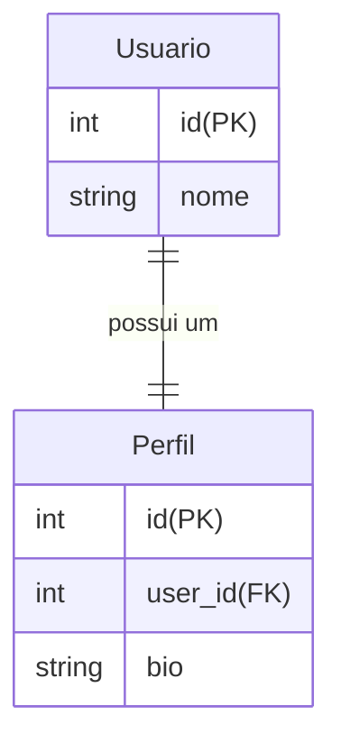
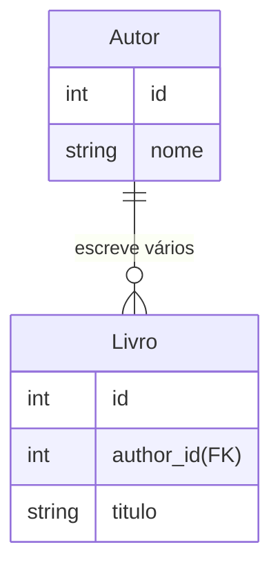
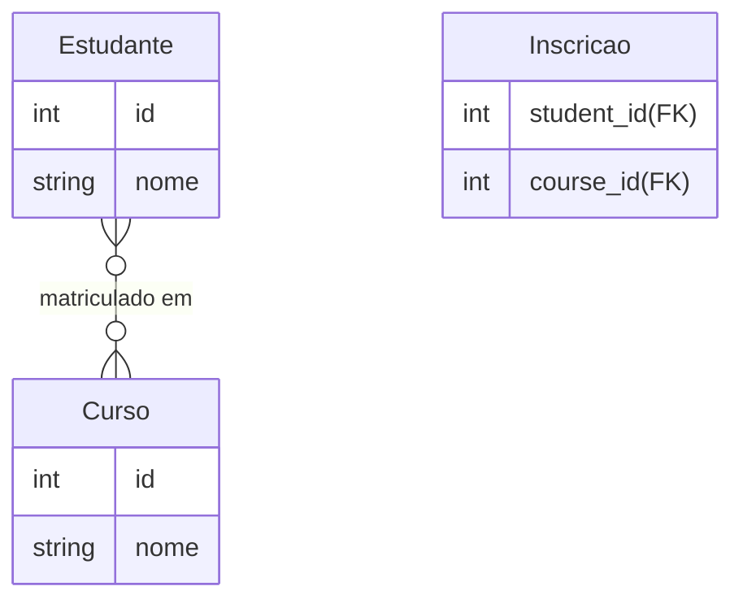
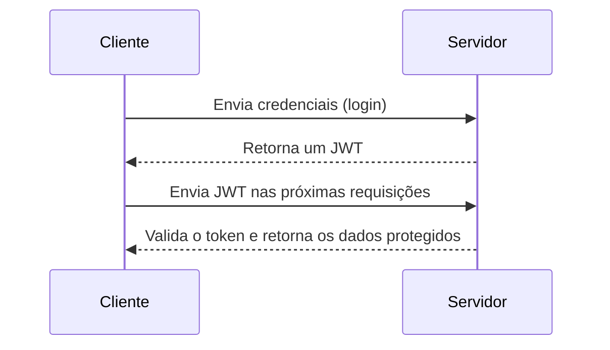

# Ata da Aula da Turma FS36 - 06 de março de 2025

## Relacionamento entre Tabelas no Banco de Dados

Os relacionamentos entre tabelas no banco de dados servem para conectar informações de diferentes entidades, garantindo integridade e evitando redundância de dados. Os principais tipos de relacionamentos são:

### 1. Relacionamento **1 para 1 (One-to-One)**
Cada registro em uma tabela está relacionado com **exatamente um** registro em outra tabela.

**Exemplo:** Um usuário tem um único perfil.



### 2. Relacionamento 1 para Muitos (One-to-Many)

Um registro em uma tabela pode estar relacionado a vários registros em outra tabela.

**Exemplo**: Um autor pode escrever vários livros.



### 3. Relacionamento Muitos para Muitos (Many-to-Many)

Vários registros em uma tabela podem estar relacionados a vários registros em outra tabela. Esse tipo de relação geralmente exige uma tabela intermediária.

**Exemplo**: Alunos podem estar matriculados em vários cursos, e cursos podem ter vários alunos.



### 4. Implementação no Sequelize
No Sequelize, os relacionamentos podem ser definidos assim:

```javascript
// 1 para 1
User.hasOne(Profile);
Profile.belongsTo(User);

// 1 para Muitos
Author.hasMany(Book);
Book.belongsTo(Author);

// Muitos para Muitos
Student.belongsToMany(Course, { through: 'Enrollment' });
Course.belongsToMany(Student, { through: 'Enrollment' });
```

Esses relacionamentos permitem consultas eficientes e garantem que os dados sejam organizados corretamente.

### 5. Documentação Oficial

Para mais detalhes sobre relacionamentos no Sequelize, consulte a documentação oficial:  
🔗 [Sequelize Associations](https://sequelize.org/docs/v6/core-concepts/assocs/)


## Expo

[Expo](https://expo.dev/) é uma plataforma para desenvolvimento de aplicativos **React Native**, facilitando a criação, teste e publicação de apps para **Android e iOS** sem configurações complexas.

### Principais vantagens:
- **Configuração simplificada**: Não é necessário configurar Xcode ou Android Studio para começar.
- **Ecossistema integrado**: Possui bibliotecas para notificações push, câmera, geolocalização e mais.
- **Testes rápidos**: Com o **Expo Go**, é possível testar o app diretamente no celular sem compilar.
- **Publicação facilitada**: Permite distribuir o app facilmente na App Store e Google Play.

🚀 **Ideal para quem quer desenvolver apps mobile de forma rápida e eficiente com React Native!**

## JSON Web Token (JWT)

### 1. O que é JWT?

JWT (JSON Web Token) é um padrão aberto para **autenticação e troca de informações seguras** entre partes. Ele é amplamente utilizado em aplicações web para **gerenciar sessões de usuários** sem necessidade de armazenar estados no servidor.

O JWT é composto por três partes:
1. **Header**: Define o tipo de token e o algoritmo de criptografia.
2. **Payload**: Contém as informações (claims) do usuário.
3. **Signature**: Garante a integridade do token.

O formato final de um JWT é:

xxxxx.yyyyy.zzzzz

Cada parte é separada por um ponto (`.`) e codificada em **Base64**.

---

### 2. Como funciona o JWT?

O fluxo básico do JWT em uma aplicação web segue estas etapas:

1. O usuário faz login com suas credenciais (e-mail/senha).
2. O servidor valida as credenciais e gera um **token JWT**.
3. O cliente recebe e armazena o token (normalmente no **localStorage** ou **cookies**).
4. Em cada requisição protegida, o cliente envia o token no **cabeçalho HTTP**.
5. O servidor valida o token e autoriza o acesso ao recurso.

### 3. Fluxo de Autenticação com JWT:



## 4. Instalando e Configurando JWT no Node.js

Para utilizar JWT em um projeto **Node.js** com **Express**, precisamos instalar a biblioteca `jsonwebtoken`:

```bash
npm install jsonwebtoken
```

Agora, criamos um servidor básico com autenticação JWT:

```javascript
const express = require('express');
const jwt = require('jsonwebtoken');

const app = express();
app.use(express.json());

const SECRET_KEY = 'minhaChaveSecreta'; // Nunca exponha isso em produção!

app.post('/login', (req, res) => {
    const { username } = req.body;

    if (!username) {
        return res.status(400).json({ message: 'Usuário é obrigatório' });
    }

    // Gerando o token
    const token = jwt.sign({ username }, SECRET_KEY, { expiresIn: '1h' });

    res.json({ token });
});

app.listen(3000, () => console.log('Servidor rodando na porta 3000'));
```

Agora, quando um usuário faz login, o servidor gera um JWT contendo o nome do usuário e o envia como resposta.

## 5. Protegendo Rotas com JWT

Após gerar o token, precisamos protegê-lo para que apenas usuários autenticados possam acessar determinadas rotas.

Criamos um **middleware** para validar o JWT em requisições protegidas:

```javascript
const authenticateToken = (req, res, next) => {
    const token = req.headers['authorization'];

    if (!token) {
        return res.status(401).json({ message: 'Acesso negado. Token não fornecido.' });
    }

    jwt.verify(token.split(' ')[1], SECRET_KEY, (err, decoded) => {
        if (err) {
            return res.status(403).json({ message: 'Token inválido.' });
        }
        req.user = decoded;
        next();
    });
};

// Rota protegida
app.get('/perfil', authenticateToken, (req, res) => {
    res.json({ message: `Bem-vindo, ${req.user.username}!` });
});
```

**Como funciona?**

1. O cliente envia o token no cabeçalho HTTP:

```bash
Authorization: Bearer <TOKEN>
```

2. O middleware verifica a autenticidade do token.
3. Se for válido, a requisição continua; caso contrário, o acesso é negado.

### 6. Expiração e Renovação de Token

Os tokens JWT podem ter um tempo de expiração para maior segurança. No exemplo anterior, usamos `{ expiresIn: '1h' }` para definir que o token expira em 1 hora.
Se um token expirar, o usuário precisará refazer login ou utilizar um refresh token.

### 7. Vantagens e Desvantagens do JWT

✅ Vantagens:

- Sem estado (stateless): Não exige armazenamento de sessão no servidor.
- Escalável: Ideal para microsserviços e autenticação distribuída.
- Seguro: Assinatura digital garante integridade dos dados.

❌ Desvantagens:

- Não pode ser revogado: Após gerado, só expira com o tempo definido.
- Payload visível: Os dados dentro do token são codificados em Base64, mas não criptografados.

### 8. Documentação Oficial

Para mais detalhes sobre JWT, consulte a documentação oficial:

🔗 [JWT.io - JSON Web Tokens](https://jwt.io/)  
🔗 [jsonwebtoken no npm](https://www.npmjs.com/package/jsonwebtoken)

## Jest

### 1. O que é Jest?

Jest é um **framework de testes em JavaScript** amplamente utilizado para testar aplicações **Node.js, React e outros projetos JS/TS**. Ele é rápido, simples de configurar e possui recursos como:

- **Execução automática** dos testes ao salvar arquivos.
- **Mocks e spies** para simular dependências.
- **Snapshots** para testar componentes React.
- **Cobertura de código** integrada.

🔹 **Site oficial:** [https://jestjs.io/](https://jestjs.io/)
🔹 **Getting Started:** [https://jestjs.io/docs/getting-started](https://jestjs.io/docs/getting-started)

---

### 2. Instalando e Configurando o Jest

Para instalar o Jest em um projeto Node.js, use:

```bash
npm install --save-dev jest
```

Em seguida, adicione um script no `package.json`:

```javascript
"scripts": {
  "test": "jest"
}
```

Agora, podemos rodar os testes com:

```bash
npm test
```

### 3. Criando o Primeiro Teste com Jest

Crie um arquivo chamado `soma.js` com a seguinte função:

```javascript
function soma(a, b) {
    return a + b;
}

module.exports = soma;
```

Agora, crie um arquivo de teste `soma.test.js`:

```javascript
const soma = require('./soma');

test('soma 1 + 2 para dar 3', () => {
    expect(soma(1, 2)).toBe(3);
});
```
Execute o teste:

```bash
npm test
```

Se tudo estiver certo, o Jest executará o teste e retornará um resultado positivo. ✅

### 4. Testando Funções Assíncronas

O Jest permite testar funções assíncronas usando `async/await` ou Promises.

### Exemplo de função assíncrona:
Crie um arquivo `usuario.js`:

```javascript
function buscarUsuario() {
    return new Promise((resolve) => {
        setTimeout(() => {
            resolve({ id: 1, nome: 'João' });
        }, 1000);
    });
}

module.exports = buscarUsuario;
```

### Criando o teste assíncrono:
Agora, crie um arquivo `usuario.test.js`:

```javascript
const buscarUsuario = require('./usuario');

test('deve retornar um usuário com nome João', async () => {
    const usuario = await buscarUsuario();
    expect(usuario.nome).toBe('João');
});
```

Execute os testes novamente:

```bash
npm test
```

Jest aguardará a execução assíncrona e verificará o resultado.

### 5. Mocks no Jest

Mocks são usados para simular funções e dependências, permitindo testar código isoladamente.

### Exemplo de Mock Function:
Crie um arquivo `servico.js`:

```javascript
function enviarEmail(usuario) {
    console.log(`Enviando e-mail para ${usuario.email}`);
    return true;
}

module.exports = enviarEmail;
```

Agora, no arquivo de teste `servico.test.js`, podemos simular essa função:

```javascript
const enviarEmail = require('./servico');

test('deve chamar a função de envio de e-mail', () => {
    const mockEnviarEmail = jest.fn().mockReturnValue(true);

    const resultado = mockEnviarEmail({ email: 'teste@email.com' });

    expect(mockEnviarEmail).toHaveBeenCalled();
    expect(resultado).toBe(true);
});
```

O `jest.fn()` cria uma função simulada, permitindo verificar se foi chamada e qual valor retornou.

### 6. Testando Cobertura de Código

O Jest possui um recurso embutido para analisar **a cobertura de código dos testes**.

Para ativá-lo, basta rodar o seguinte comando:

```bash
npm test -- --coverage
```

Isso gera um relatório indicando quais partes do código foram testadas e quais não foram.

### Exemplo de saída:
```psql
--------------------|---------|----------|---------|---------|-------------------
File                | % Stmts | % Branch | % Funcs | % Lines | Uncovered Line #s
--------------------|---------|----------|---------|---------|-------------------
All files          |   85.71 |     75.00 |   66.67 |   85.71 |                   
 soma.js           |   100.0 |    100.0  |   100.0 |   100.0 |                   
 usuario.js        |   75.00 |     50.00 |    50.0 |   75.00 | 3-5               
--------------------|---------|----------|---------|---------|-------------------
```

O relatório mostra a porcentagem de código testado. O objetivo é sempre maximizar essa cobertura para garantir que todas as partes críticas do sistema estejam testadas.

### 7. Configuração Avançada do Jest

Para personalizar o Jest, podemos criar um arquivo `jest.config.js` na raiz do projeto:

```javascript
module.exports = {
    testEnvironment: 'node', // Define o ambiente de execução dos testes
    collectCoverage: true,   // Ativa a cobertura de testes
    coverageDirectory: 'coverage', // Define onde os relatórios de cobertura serão armazenados
    verbose: true,           // Exibe mais detalhes na execução dos testes
};
```

Agora, ao rodar `npm test`, o Jest usará essa configuração personalizada.

## CYPRESS
