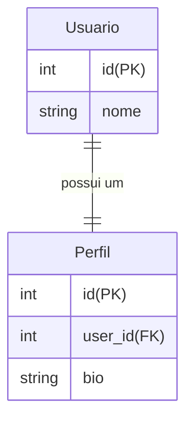
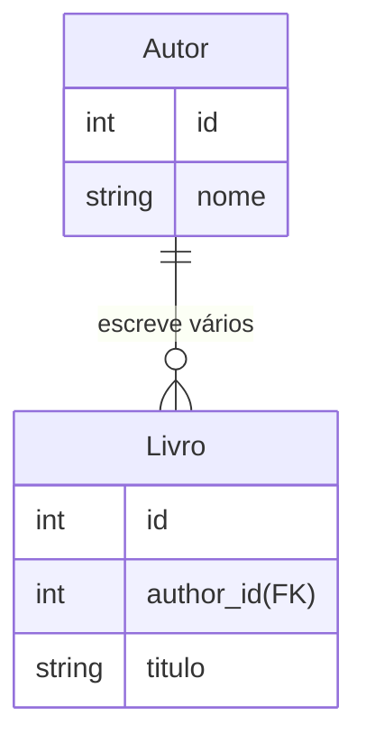
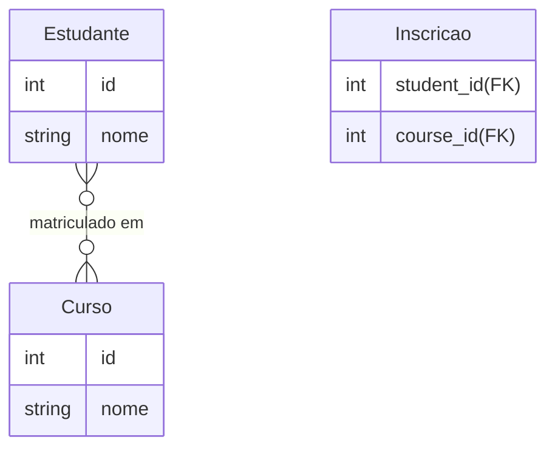

# Ata da Aula da Turma FS36 - 06 de março de 2025

## Relacionamento entre Tabelas no Banco de Dados

Os relacionamentos entre tabelas no banco de dados servem para conectar informações de diferentes entidades, garantindo integridade e evitando redundância de dados. Os principais tipos de relacionamentos são:

### 1. Relacionamento **1 para 1 (One-to-One)**
Cada registro em uma tabela está relacionado com **exatamente um** registro em outra tabela.

**Exemplo:** Um usuário tem um único perfil.



### 2. Relacionamento 1 para Muitos (One-to-Many)

Um registro em uma tabela pode estar relacionado a vários registros em outra tabela.

**Exemplo**: Um autor pode escrever vários livros.



### 3. Relacionamento Muitos para Muitos (Many-to-Many)

Vários registros em uma tabela podem estar relacionados a vários registros em outra tabela. Esse tipo de relação geralmente exige uma tabela intermediária.

**Exemplo**: Alunos podem estar matriculados em vários cursos, e cursos podem ter vários alunos.



### 4. Implementação no Sequelize
No Sequelize, os relacionamentos podem ser definidos assim:

```javascript
// 1 para 1
User.hasOne(Profile);
Profile.belongsTo(User);

// 1 para Muitos
Author.hasMany(Book);
Book.belongsTo(Author);

// Muitos para Muitos
Student.belongsToMany(Course, { through: 'Enrollment' });
Course.belongsToMany(Student, { through: 'Enrollment' });
```

Esses relacionamentos permitem consultas eficientes e garantem que os dados sejam organizados corretamente.

### 5. Documentação Oficial

Para mais detalhes sobre relacionamentos no Sequelize, consulte a documentação oficial:  
🔗 [Sequelize Associations](https://sequelize.org/docs/v6/core-concepts/assocs/)


## Expo

[Expo](https://expo.dev/) é uma plataforma para desenvolvimento de aplicativos **React Native**, facilitando a criação, teste e publicação de apps para **Android e iOS** sem configurações complexas.

### Principais vantagens:
- **Configuração simplificada**: Não é necessário configurar Xcode ou Android Studio para começar.
- **Ecossistema integrado**: Possui bibliotecas para notificações push, câmera, geolocalização e mais.
- **Testes rápidos**: Com o **Expo Go**, é possível testar o app diretamente no celular sem compilar.
- **Publicação facilitada**: Permite distribuir o app facilmente na App Store e Google Play.

🚀 **Ideal para quem quer desenvolver apps mobile de forma rápida e eficiente com React Native!**

