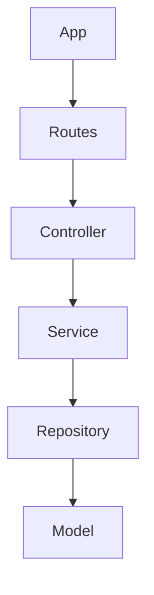

# Ata da Aula da Turma FS36 - 13 de fevereiro de 2025

## Inicialização de um projeto backend
- Comandos iniciais
- Instalação de bibliotecas básicas:
  - dotenv
  - express
  - nodemon
  - pg
  - sequelize

## Camadas de uma aplicação
- **App**: Ponto de entrada da aplicação
- **Service**: Contém as regras de negócio
- **Model**: Contém a modelagem de uma entidade (dados de uma tabela no banco de dados)
- **Controller**: Intermediário entre a rota e o service
- **Routes**: Configurações de rotas do projeto
- **Repository**: Intermediário entre o ORM e a camada de serviços

## Esquema mermaid

## Indicação de curso sobre Clean Architecture
- **Curso**: NodeJs, Typescript, TDD, DDD, Clean Architecture e SOLID
- **Criado por**: Rodrigo Manguinho
- **Link**: [Udemy Course](https://www.udemy.com/course/tdd-com-mango/?utm_source=adwords&utm_medium=udemyads&utm_campaign=MX_FF-CONV_BR_Search-NB_DSA_GammaCatchall_la.PT_Google&campaigntype=Search&portfolio=Brazil&language=PT&product=Course&test=&audience=DSA&topic=&priority=Gamma&funnel=Conversion&utm_content=&utm_term=_._ag_171903008064_._ad_706479958704_._kw__._de_c_._dm__._pl__._ti_dsa-1456167871416_._li_9222782_._pd__._&matchtype=&gad_source=1&gclid=CjwKCAiAzba9BhBhEiwA7glbagW40VWL0O5Isgk2B7yC-aXV4ZLk02mH4jnVEHdXekpOLkdXLoNyxRoCqu4QAvD_BwE)