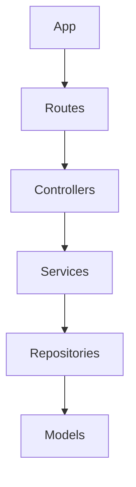
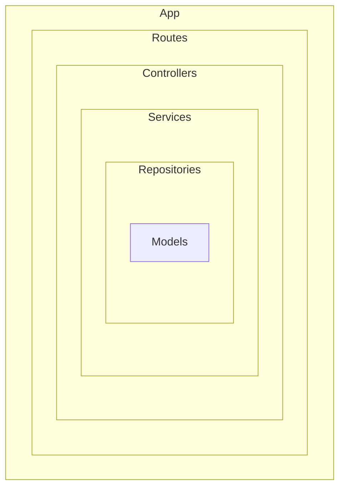

# Ata da Aula da Turma FS36 - 13 de fevereiro de 2025

## Inicialização de um projeto backend
- Comandos iniciais
- Instalação de bibliotecas básicas:
  - dotenv
  - express
  - nodemon
  - pg
  - sequelize

## Noções de Arquitetura em Camadas
- Essa estrutura é bastante usada em aplicações Node.js com frameworks como Express e NestJS, pois promove a separação de responsabilidades e facilita manutenção e testes.

## Camadas de uma aplicação
- **App**: Ponto de entrada da aplicação
- **Routes (Rotas)**: Define os endpoints e direciona as requisições.
- **Controllers (Controladores)**: Processa as requisições, chamando os serviços necessários, é um intermediário entre as camadas de rotas e serviços.
- **Services (Serviços)**: Contém a lógica de negócio da aplicação.
- **Repositories (Repositórios)**: Responsável por acessar o banco de dados, geralmente interagindo com os Models.
- **Models (Modelos)**: Representam as entidades e suas estruturas no banco de dados.

## Esquema mermaid

## Indicação de curso sobre Clean Architecture
- **Curso**: NodeJs, Typescript, TDD, DDD, Clean Architecture e SOLID
- **Criado por**: Rodrigo Manguinho
- **Link**: [Udemy Course](https://www.udemy.com/course/tdd-com-mango/?utm_source=adwords&utm_medium=udemyads&utm_campaign=MX_FF-CONV_BR_Search-NB_DSA_GammaCatchall_la.PT_Google&campaigntype=Search&portfolio=Brazil&language=PT&product=Course&test=&audience=DSA&topic=&priority=Gamma&funnel=Conversion&utm_content=&utm_term=_._ag_171903008064_._ad_706479958704_._kw__._de_c_._dm__._pl__._ti_dsa-1456167871416_._li_9222782_._pd__._&matchtype=&gad_source=1&gclid=CjwKCAiAzba9BhBhEiwA7glbagW40VWL0O5Isgk2B7yC-aXV4ZLk02mH4jnVEHdXekpOLkdXLoNyxRoCqu4QAvD_BwE)